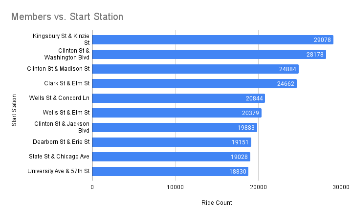

# Project Background
Cyclistic is a bike-share company based in Chicago, with over 5,800 bicycles and 600 docking stations. Most cyclistic users are likely to ride for leisure, but 30% use the bikes to commute to work each day. Cyclistic has concluded that while flexible pricing attracts more customers, annual members are more profitable. This project analyses trip data to uncover patterns between casual riders and members that can be used to increase membership conversion among casual riders. 

Insights and recommendations are provided on the following key areas:

- **Trip Frequency & Duration** (What are the differences in overall usage volume?)
- **Temporal Usage Patterns** When do casual and member riders use the service? Including peak hours, days of the week, and seasonal trends.
- **Spatial Usage & Route Preferences** Where do casual vs. member riders go? Analysing and comparing station usage, popular routes, and destinations between casual and member riders
- **Ride Type & Contex**t How do trip characteristics differ between casual and member riders? The differences between bikes used, are there more one-way vs round trips? 

The SQL queries used to inspect and clean the data for this analysis can be found here [link].

Targeted SQL queries regarding various business questions can be found here [link].

# Data Structure & Initial Checks
I analysed one year's worth of trip data - spanning between November 2023 and October 2024. 

The dataset, made available by Motivate International Inc, comprised 5933712 columns and 13 columns, containing the following information:

- **ride_id:** unique identifier for logged rides
- **rideable_bike:** type of bike (classic, electric、electric scooters)
- **started_at:** the date and time in which the ride started (M/d/yyyy hh:mm)
- **ended_at:** the date and time in which the ride ended (M/d/yyyy hh:mm)
- **start_station_name:** the station name where the ride started
- **start_station_id:** the id for the start station
- **end_station_name:** the station name where the ride ended
- **end_station_id:** the id for the end station
- **start_lat:** the latitude of the starting station
- **start_lng:** the longitude of the starting station
- **end_lat:** the latitude of the ending station
- **end_lng:** the longitude of the ending station
- **member_casual:** the type of rider (member, casual)

The raw data, provided as monthly CSV files, was initially processed in Microsoft Excel to engineer key features. Specifically, I added a 'day_of_week' column for temporal analysis and calculated 'trip_duration' in seconds by subtracting the 'start_time' from the 'end_time'. These monthly files were then combined into a single dataset using Google BigQuery's UNION ALL. 

To ensure the accuracy of ride duration analysis, outliers were identified and addressed. Specifically:
- **Negative or Zero Durations**: Rides with negative or zero durations were removed. From the original table, this resulted in over 117,287 rides, which is about 1.97% of the rides.
- 
Following data cleaning, several new features were added in SQL BigQuery

- **Ride length:** To facilitate analysis of ride durations, a new feature, 'ride_length_minutes', was engineered from the existing 'ride_length' column. The 'ride_length' column was originally stored as a string in HH:MM:SS (hours, minutes, seconds) format. To convert these durations into minutes, the following SQL query was executed: A ‘ride_duration_minutes’ was created by taking the ‘ride_length’ column. This was done by a SQL query converting the 'ride_length' column, initially in HH:MM:SS format, to minutes. It split the string by colons, extracted hours, minutes, and seconds, then calculated minutes as (hours * 60) + minutes + (seconds / 60), creating the 'ride_length_minutes' column for numerical analysis.
- **A ‘distance_km’**: column was added using the Haversine formula

# Executive Summary
### Overview of Findings
Explain the overarching findings, trends, and themes in 2-3 sentences here. This section should address the question: "If a stakeholder were to take away 3 main insights from your project, what are the most important things they should know?" You can put yourself in the shoes of a specific stakeholder - for example, a marketing manager or finance director - to think creatively about this section.

Casual riders took longer rides but rode less frequently, especially on classic bikes, suggesting recreational use. 
Casual riders use bikes more on weekends and in tourist-heavy areas.
Members took more rides, which were shorter, structured, and commuter-focused.
The afternoon is the most popular riding time for casual riders and members, but the morning rush hour is also significant for members.

[Visualization, including a graph of overall trends or snapshot of a dashboard]

# Insights Deep Dive
**Trip Frequency & Duration**
* **Members are taking more rides than casual riders**
  
Overall, members account for the majority of rides, making up **63.7%** of total trips, while casual riders contribute **36.3%**. Casual riders, though making up a smaller proportion, still represent a significant share of trips, suggesting strong demand from occasional users, tourists, or those without memberships. This breakdown will help spot user patterns, adjust bike availability, and develop ways to better convert casual riders into members. 

* **Casual riders were taking longer rides than members**
  
Ride duration data was highly skewed, with a notable presence of rides with extreme durations. Because of this, I used the median to describe typical ride lengths. This analysis showed that casual riders had a median ride duration of 12.43 minutes, compared to 9 minutes. Casual riders had a bigger difference between their median and average duration than members. This could suggest that casual riders are taking longer and more leisurely rides, whereas members could be using the service for commuting purposes. 

To better understand the differences in ride durations between casual and member riders, I categorised the data into the following duration bins: 1-10 minutes, 11-20 minutes, 21-30 minutes, 31-40 minutes and over 41 minutes. Analysis showed a significant difference between casual riders and member riders. A large proportion of member rides fell between 1-10 minutes (61.77%) and 11-20 minutes (26.62%). Casual riders, while still having a significant portion of short rides, show a more diverse range of ride durations. A larger proportion of casual riders fall in the longer duration bins than members, especially for rides over 20 minutes. 32.21% of casual rides compared to 13.98% of members. 

  
* **Casual Riders have seen faster growth with larger fluctuations.**
  
It can be observed that casual riders have experienced a cumulative growth of **208.29%**, reflecting significant growth over time. In contrast, members achieved a cumulative growth of **76.59%**, which shows a slower growth trajectory.
  
* Casual riders exhibited much more volatility in comparison to members when it came to **month-to-month growth**

There is larger volatility in the growth rate, as seen with very high growth in February 2024 **(+93.69%)** and severe negative growth in October 2024 **(-37.08%)**. These extremes indicate that casual riders are more sensitive to certain factors, like weather, which can lead to larger variations in monthly ridership. In contrast, while members also saw a drop in rides during the same months (**-34.72%** in December 2023, **-30.57%** in January 2024, and **-15.24%** in October 2024), their declines were less pronounced than those of casual riders. Members saw a strong rebound in February** (+47.28%)**, which could be a reflection of improved weather that encouraged more rides. From August to October 2024, there was growth but slower and then we saw a decline again in October of **-15.24%**. This could further point to seasonal factors that impact membership growth and ridership. 

### Temporal Usage Analysis:

* The afternoon (3-5 PM) time bin was the most popular for both members and casual riders, with 989,829 rides by members and 556,759 by casual riders. The Morning Rush (6-9 AM) also saw a significant number of rides by members with 729,831 rides clocked. This is over three times higher than casual riders at 230, 235 rides. 
  
* **Casual riders favoured weekend rides.**
Saturdays and Sundays saw the most casual rider trips, further reinforcing the idea their trips are more for leisurely purposes, as opposed to work-related. Both electric and classic bikes were equally popular. Weekend ridership among members was lower, suggesting their rides were more work-related than recreational. Members rode more consistently throughout the week, whereas casual riders peaked during weekends, particularly on Saturdays. As for ride duration, for members and casual riders, the longest rides occurred on weekends using classic bikes.

* July to September, the peak summer months, saw the highest number of rides, while the winter months (December to February) had the lowest usage. Casual riders were most active in summer, accounting for 43.11% of their rides, while members also favoured summer but to a lesser extent (30.26%). Autumn was the second most popular season for both groups, with 30.45% of casual rides and 33.86% of member rides. While winter was the least popular season for both types of riders, a higher proportion of members were still riding in winter than casual riders.  

* While casual riders showed a strong seasonal preference, members' ride distribution was more balanced across summer, autumn, and spring, indicating more consistent year-round usage"
  
* Casual riders were riding for longer in summer with a median duration of **13.88 minutes**, and further with a median distance of** 1.75 km**. 

### Spacial Usage Analysis:
Results from analysing start station data show that ride distribution is spread out, with no single station accounting for a dominant share of rides. For both members and casual riders, the most frequently used stations each represent less than 3% of total rides. However, distinct trends emerge when comparing station preferences between these two groups.

* **Casual riders are frequently riding more around tourist destinations** It was seen that casual riders tend to favour stations near tourist destinations, cultural sites, and recreational areas. Locations such as Streeter Dr & Grand Ave, DuSable Lake Shore & Monroe St/ North Blvd, Michigan Ave & Oak St, and Millennium Park, are among the most utilized. These areas are near well-known landmarks or popular spots, such as Navy Pier, Grant Park, The Magnificent Mile, and Millennium Park. This supports the idea that casual users are more likely to use the service for recreational purposes or social outings rather than daily commuting.

* **The longer median durations at the most popular stations suggest rides are for recreational purposes as opposed to short commutes**

Many of the top stations for casual riders have longer median durations.This suggest that casual rides are primarily for recreational purposes rather than short commutes. Many of these stations are located near Chicago’s major attractions, waterfront areas, and parks, such as Millennium Park **(24.00 min)**, the Shedd Aquarium **(22.12 min)**, and the Adler Planetarium **(24.43 min)**. Notably, stations along DuSable Lake Shore Drive, including Monroe St (24.57 min) and North Blvd (19.18 min), also exhibit extended ride durations, reinforcing the trend of recreational riding. Compared to high-traffic commuter stations, such as Kingsbury St & Kinzie St (8.67 min) and Wells St & Elm St (9.18 min), which are popular for members. These differences highlight how location influences riding behavior.

Among the top 20 stations visited for casual riders, two of them overlap with the top two stations for members. The median duration at these stations is shorter than the other stations. This could suggest that a portion of casual riders are also using this service for commuting purposes. 
( More casual riders are starting at: Michigan Ave & 8th St than riders starting elsewhere and ending their riders here. The majority of the rides starting at Michigan Ave & 8th St also end up finishing here. 

* **Members rides are concentrated near major transit hubs, business districts, and residential areas.** Among members, the top stations are concentrated near major transit hubs, business districts, and residential areas with strong commuting activity. Stations such as **Kingsbury & Kenzie St**, **Clinton St & Washington Bld**/ **Madison St** / **Jackson Blvd**, rank among the most popular stations. The areas that members seem to be frequenting include: Willis Tower, The West Loop, River North, and The Loop. Many of these places are a combination of businesses, tourism, entertainment and nightlife. The Loop is considered Chicago's central business district (CBD). The West Loop is a former industrial area transformed into a trendy neighbourhood full of restaurants, art galleries, and nightlife. The West Loop is also considered a transit hub, with **Union Station** and **Oglivie Transportation Center**. This makes it an ideal location for work and commuting. 
  
* **Many members are also riding close to universities.** Among the top stations visited by members, Clinton St & Jackson Blvd, Morgan St & Polk St, and University Ave & 57th St are near universities such as The University of Chicago and University of Illinois Chicago. The popularity of these stations further reinforces the idea that members primarily commuting.

### Ride Type & Context

Ride Type & Context (How do trip characteristics differ between casual and member riders?)

Differences in the type of bike used (if applicable, e.g., classic vs. e-bike).

Are casual rides more likely to be one-way vs. round trips?

Are casual trips more dispersed, while member trips are more structured (e.g., more similar start/end locations per trip)?

* **Electric bikes were the most popular for both members and casual riders**. The three types of bicycles available are: Classic, electric bikes, and electric scooters. Electric bikes were the most popular for members and casual riders, with 1.84 million rides taken by members and 1.04 million by casual riders. Classic bikes were also widely used, with 1.8 million rides by members and 982,930 by casual riders. Interestingly, electric scooters were much less popular, particularly among members, with only 56,145 rides, compared to 81,468 rides taken by casual riders.

* **Main insight 1.** More detail about the supporting analysis about this insight, including time frames, quantitative values, and observations about trends.
  
* **Main insight 2.** More detail about the supporting analysis about this insight, including time frames, quantitative values, and observations about trends.
  
* **Main insight 3.** More detail about the supporting analysis about this insight, including time frames, quantitative values, and observations about trends.
  
* **Main insight 4.** More detail about the supporting analysis about this insight, including time frames, quantitative values, and observations about trends.

[Visualization specific to category 4]

## Recommendations:
Based on the insights and findings above, we would recommend the [stakeholder team] to consider the following: 

* **TOP STATIONS FOR CASUAL RIDERS;**
_Local Partnerships & Cross-Promotions 🤝
Collaborating with gyms, coffee shops, or coworking spaces to offer bundled discounts.
Example: “Show your ride receipt at [Local Café] and get 10% off your coffee!”_

*  Rather than scaling back marketing efforts during these downturns, research suggests that companies that continue investing in strategic marketing during economic slowdowns achieve stronger long-term growth.

A study by McKinsey & Company found that businesses that maintained or increased their marketing efforts during downturns achieved a 17% compounded growth rate. Applying this principle to ridership trends, targeted marketing campaigns during these off-peak months could mitigate losses and potentially convert casual riders into members.
Increased Marketing Efforts in Negative Growth Periods: The months where growth dropped significantly (December and October) could be targeted for special promotions, re-engagement offers, or referral programs to counteract negative growth.
_- Limited-Time Seasonal Promotions 
Offering discounted multi-ride passes or membership trials during low-ridership months (e.g., winter discounts or commuter perks).
Example: “Winter Ride Challenge: Complete 10 rides in December and get 1 month of free membership!”_

Reinforce Successful Strategies: The periods of high growth in February, March, and May could provide insights into which marketing strategies worked well, allowing you to replicate these efforts during similar months in the future.

* Specific observation that is related to a recommended action. **Recommendation or general guidance based on this observation.**
  
* Specific observation that is related to a recommended action. **Recommendation or general guidance based on this observation.**
  

# Assumptions and Caveats:

Null Values in Station Data: Some data on the start and end stations were missing (nulls). This could affect the analysis of the most popular stations and routes. While this limitation does not drastically alter the main findings, the absence of these data points may slightly skew the results, particularly in identifying optimal areas for membership conversion.

Generalization of Usage Patterns: We assume that the trip behavior patterns for casual and member riders are broadly representative of typical usage. However, due to the lack of individual-level data, these patterns are inferred from aggregated data and may not fully capture all the nuances of rider behavior.

Temporal Data Gaps: Some temporal data may be incomplete due to missing timestamps or edge cases in the data collection process. This was accounted for, but stakeholders should note that unusual spikes in activity or non-standard patterns may not be fully explained.

Throughout the analysis, multiple assumptions were made to manage challenges with the data. These assumptions and caveats are noted below:

* Assumption 1 (ex: missing country records were for customers based in the US, and were re-coded to be US citizens)
  
* Assumption 1 (ex: data for December 2021 was missing - this was imputed using a combination of historical trends and December 2020 data)
  
* Assumption 1 (ex: because 3% of the refund date column contained non-sensical dates, these were excluded from the analysis)
